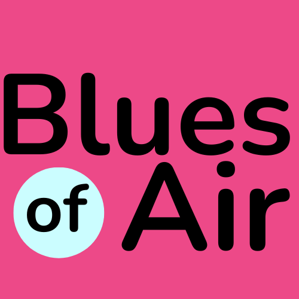

<a name="readme-top"></a>


<div align="center">
  
  <br/>

</div>

<!-- TABLE OF CONTENTS -->

# 📗 Table of Contents

- [📖 About the Project](#about-project)
  - [🛠 Built With](#built-with)
    - [Tech Stack](#tech-stack)
    - [Key Features](#key-features)
  - [🚀 Live Demo](#live-demo)
- [💻 Getting Started](#getting-started)
  - [Prerequisites](#prerequisites)
  - [Setup](#setup)
  - [Install](#install)
  - [Usage](#usage)
- [👥 Author](#author)
- [🔭 Future Features](#future-features)
- [🤝 Contributing](#contributing)
- [⭐️ Show your support](#support)
- [📝 License](#license)

<!-- PROJECT DESCRIPTION -->

#  🟦 Blues of Air <a name="about-project"></a>

**Blues of Air** is an application that displays air pollution data for countries while implementing a visually apealing and easy to navigate interface.


## 🛠 Built With <a name="built-with"></a>

### Tech Stack <a name="tech-stack"></a>
<details>
  <summary>Client</summary>
  <ul>
    <li><a href="https://reactjs.org/">React.js</a></li>
    <li><a href="https://reactjs.org/">Redux</a></li>
  </ul>
</details>

<!-- Features -->

### Key Features <a name="key-features"></a>

- **Home page with countries listed in a grid**
- **Detail page for pollution data for each country**
- **Open weather map API integration**
- **State Management with Redux**

<p align="right">(<a href="#readme-top">back to top</a>)</p>

<!-- LIVE DEMO -->

## 🚀 Live Demo <a name="live-demo"></a>

- [Live Demo Link](https://blues-of-air.netlify.app/)

<p align="right">(<a href="#readme-top">back to top</a>)</p>

<!-- GETTING STARTED -->

## 💻 Getting Started <a name="getting-started"></a>

To get a local copy up and running, follow these steps.

### Prerequisites

In order to run this project you need:

Node version greater than `16.15.1`


### Setup

Clone this repository to your desired folder:


```sh
  cd my-folder
  git clone https://github.com/sumairq/blues-of-air.git
```

### Install

Install this project with:


```sh
  cd blues-of-air
  npm install
```

### Usage

To run the project, execute the following command:

```sh
  npm start
```

<p align="right">(<a href="#readme-top">back to top</a>)</p>

## 👥 Author <a name="author"></a>

👤 **Sumair**

- GitHub: [@githubhandle](https://github.com/githubhandle)
- Twitter: [@twitterhandle](https://twitter.com/twitterhandle)
- LinkedIn: [LinkedIn](https://linkedin.com/in/linkedinhandle)

<p align="right">(<a href="#readme-top">back to top</a>)</p>

<!-- FUTURE FEATURES -->

## 🔭 Future Features <a name="future-features"></a>

- [ ] **Authentication**
- [ ] **Categories Page**

<p align="right">(<a href="#readme-top">back to top</a>)</p>

<!-- CONTRIBUTING -->

## 🤝 Contributing <a name="contributing"></a>

Contributions, issues, and feature requests are welcome!

Feel free to check the [issues page](../../issues/).

<p align="right">(<a href="#readme-top">back to top</a>)</p>

<!-- SUPPORT -->

## ⭐️ Show your support <a name="support"></a>

If you like this project please give it a ⭐️.

<p align="right">(<a href="#readme-top">back to top</a>)</p>

## Acknowledgments

- Inspiration [Nelson Sakwa in Behance](https://www.behance.net/sakwadesignstudio)

<!-- LICENSE -->

## 📝 License <a name="license"></a>

This project is [MIT](./LICENSE) licensed.

<p align="right">(<a href="#readme-top">back to top</a>)</p>
